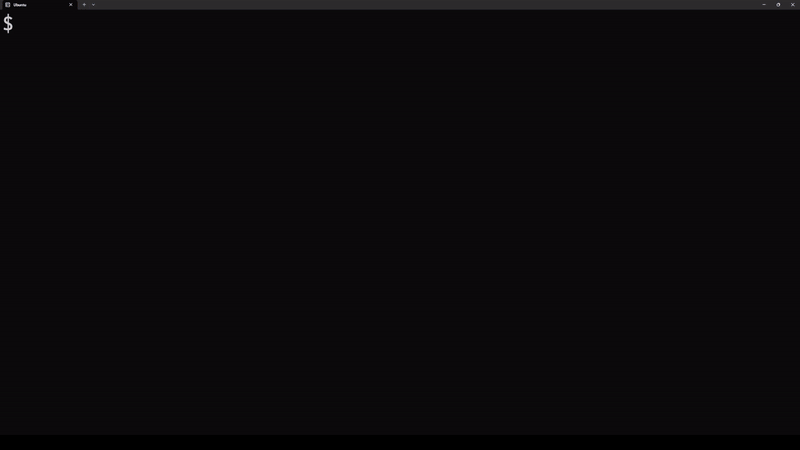
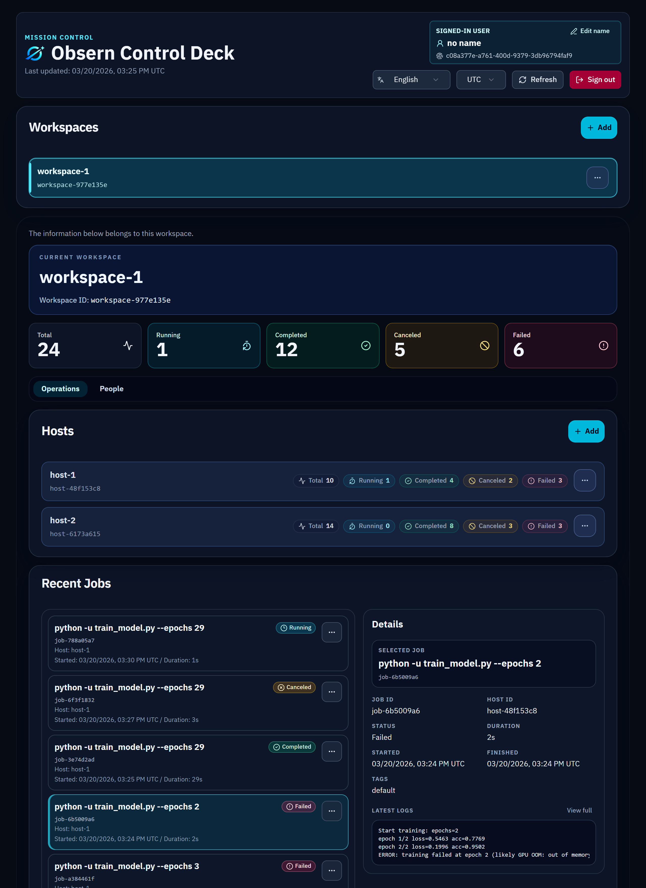
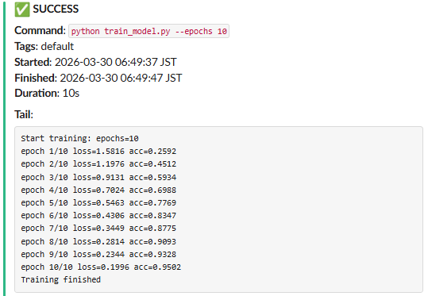
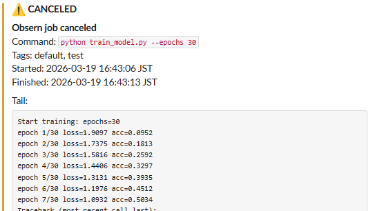
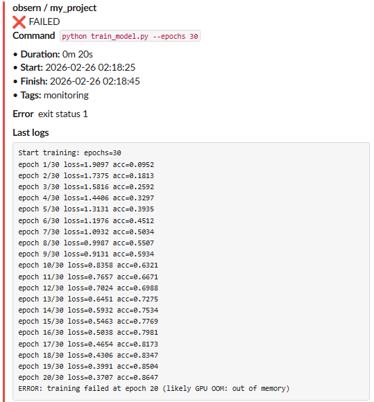

<p align="center">
  
</p>

<h1 align="center">Obsern</h1>
<p align="center">
  <a href="./README.md">English</a> | <a href="./README.ja.md"><strong>日本語</strong></a>
</p>
<p align="center">
  
  
  
  
</p>
<p align="center">
  機械学習ジョブの「確認のためのSSH」を不要にするプロセス監視ツール<br />
  複数サーバー対応・軽量・SDK不要で数分で導入できます
</p>
<p align="center">
  <a href="https://obsern.dev">Website</a> | <a href="https://app.obsern.dev">Dashboard</a> | <a href="https://obsern.dev/docs">Documentation</a>
</p>
<p align="center">
  <sub>※ Obsern 公式サーバーは現在 β 版として試験的に提供中であり、予告なく停止・変更される場合があります。</sub>
</p>

<p align="center">
  
</p>

Obsern は、長時間ジョブの実行状態を軽量に追跡するためのツールです。

数時間から数日かかるプロセスを対象に、次のことをCLIで扱いやすくします。

- 実行状態の追跡
- stdout / stderr の把握
- ダッシュボードによる可視化
- 通知

特に、次のような価値を重視しています。

- 学習コードを変更せずに導入できる
- SSH せずに長時間ジョブの状態を確認できる
- 複数サーバーの実行状況を一箇所で把握できる

SDK統合は一切不要。任意のコマンドをラップするだけで利用できます。

```bash
obsern run python train.py
```

## 📚 目次

- [📦 インストール](#インストール)
- [⚡ クイックスタート](#クイックスタート)
- [🌱 背景](#背景)
- [🎯 Obsern が解決したいこと](#obsern-が解決したいこと)
- [✨ 主な機能](#主な機能)
- [🏗️ アーキテクチャ](#アーキテクチャ)
- [🆚 他ツールとの比較](#他ツールとの比較)
- [📁 リポジトリ構成](#リポジトリ構成)
- [🛠️ 技術スタック](#技術スタック)
- [🚧 開発状況](#開発状況)
- [📄 ライセンス](#ライセンス)

<a id="インストール"></a>
## 📦 インストール

```bash
curl -fsSL https://github.com/kazuki-kanaya/obsern/releases/latest/download/install.sh | sh
```

※ 現在は Unix 環境を前提としています。

<a id="クイックスタート"></a>
## ⚡ クイックスタート

3分で試せます。

### 1. 🧭 初期化

```bash
obsern init
```

設定ファイルが生成されます:

```text
obsern.yaml
```

---

### 2. 🔧 設定

※ `host_token` または通知用 Webhook のいずれかが必要です

* `host_token` はダッシュボードから発行できます
  → https://app.obsern.dev

* Slack Webhook URL の取得方法
  → https://docs.slack.dev/messaging/sending-messages-using-incoming-webhooks

* Discord Webhook URL の取得方法
  → https://support.discord.com/hc/en-us/articles/228383668-Intro-to-Webhooks

以下のいずれかを `obsern.yaml` に設定してください。

```yaml
# obsern.yaml

# ダッシュボード連携する場合
api:
  host_token: your_token_here
  base_url: https://api.obsern.dev

# 通知だけ使う場合は Slack / Discord のどちらか、または両方を設定
notify:
  slack:
    webhook_url: https://hooks.slack.com/services/xxx/yyy/zzz
  discord:
    webhook_url: https://discord.com/api/webhooks/xxx/yyy
```

---

### 3. ▶️ コマンド実行

任意のコマンドをそのままラップして実行できます。

```bash
obsern run python train.py
```

例:

```bash
obsern run python train.py --epochs 10
obsern run -- python train.py --epochs 10
obsern run bash -lc 'echo hi && sleep 1'
```

---

実行中の状態は追跡され、終了時には結果が記録されます。
設定に応じて、完了や失敗を通知で受け取ることもできます。

SDKの導入やコード変更は一切不要です。

<a id="背景"></a>
## 🌱 背景

GPUサーバーで長時間の機械学習ジョブを回していると、実行状態の把握に多くの手間がかかります。

私は普段、研究室で複数のGPUサーバーを使い、学習ジョブを並列実行しています。
1つの実験には1週間から2週間程度かかることもあります。

しかし実際には、次のような問題が頻繁に起きます。

* 実行直後にジョブが落ちる（CUDA OOM、パスミス、データエラーなど）
* それに気づかず、数日後に確認して初めて失敗に気づく
* チームで使っていると、どのGPUサーバーが空いているかをSSHして確認するか、誰かに連絡して確認する必要がある

結果として、計算資源と時間を無駄にすることになります。

---

ログの扱いにも問題があります。

nohupで実行した場合、ログは `nohup.out` に出力されますが、
tqdmなどの影響で改行が多くなり、ファイルサイズが肥大化しやすくなります。

そのためログを削除してしまい、後から原因が追えなくなることもありました。

---

結局、状態確認のために行っていたのは次のような作業です。

```bash
ssh gpu-server
ps aux | grep python
nvidia-smi
```

これを1日に何度も繰り返すことになります。

さらに、サーバーが複数台ある場合は、この作業を台数分繰り返す必要があります。

* gpu-server-1
* gpu-server-2
* gpu-server-3

それぞれにSSHして、同じ確認を行う。

台数が増えるほど手間も増え、どこで何が動いているのか把握しづらくなります。

---

このように、単に「プロセスが生きているか」を確認するためだけにSSHを行う状況は非効率です。

---

Obsernは、この問題を解決するために開発しました。

* SSH不要でプロセス状態を確認
* 複数サーバーの実行状況の一元管理
* 異常の早期検知・内容把握
* プロセス終了の即時通知

長時間ジョブの運用における手動確認を減らすことを目的としています。

<a id="obsern-が解決したいこと"></a>
## 🎯 Obsern が解決したいこと

長時間ジョブ運用では、次のような問題が起きがちです。

### 💥 ジョブが落ちても気づかない

GPU 学習では、次のような理由で開始直後に落ちることがあります。

- CUDA OOM
- データエラー
- パスミス

### 🔍 状態確認のためだけに SSH する

```bash
ssh gpu-server
ps aux | grep python
nvidia-smi
```

こうした確認を何度も繰り返す必要があります。

### 🧩 複数サーバーで状態が散らばる

- `gpu-server-1`
- `gpu-server-2`
- `gpu-server-3`

どこで何が動いているのか把握しづらくなります。

### 👥 チーム利用時に空きサーバーが分かりにくい

どの GPU サーバーが空いているかを確認するために、

- それぞれのサーバーへ SSH する
- あるいは他のメンバーに連絡する

といった運用になりがちです。

Obsern は、次の機能によってこれらの問題を解決することを目指しています。

- 実行状態追跡
- stdout / stderr の収集
- ダッシュボード可視化
- 通知

<a id="主な機能"></a>
## ✨ 主な機能

### ▶️ 任意コマンドのラップ実行

任意の CLI コマンドをそのまま実行できます。

```bash
obsern run python train.py
obsern run bash script.sh
obsern run bash -lc 'echo hi && sleep 1'
```

### 📜 stdout / stderr の把握

Obsern は、実行中の出力をユーザー端末に流しつつ、終了時には末尾ログを保持できるようにする方針です。

これにより、次のような作業を減らせます。

- `nohup` ログの確認
- SSH してからのログ確認

### 🛰️ 実行状態の追跡

ジョブの状態を追跡します。

扱う状態:

- `running`
- `finished`
- `failed`
- `canceled`

### 🖥️ ダッシュボード

Web UI からホストの登録やジョブ状態の確認ができます。
チーム利用も想定しており、メンバー招待や権限管理にも対応しています。

<p align="center">
  
</p>

### 🔔 通知

ジョブの完了や失敗を通知できます。

現在:

- Slack
- Discord

通知例（Slack）：

<p align="center">
  
  
  
</p>

### 🌍 ローカル / クラウド両対応

Obsern は次のような環境で利用できます。

- ローカル環境
- オンプレミス環境
- クラウド環境

ダッシュボード連携を使う場合は、接続先のサーバーが必要です。

- 自前でサーバーを用意して接続する
- もしくは、β 版として試験的に提供中の Obsern 公式サーバーを利用する（予告なく停止・変更される場合があります）

一方、通知機能だけであれば、CLI をインストールするだけで利用できます。

## 🚫 やらないこと

Obsern は、あえて次のような領域には広げていません。

- フル機能の実験管理プラットフォームにはしない
- 学習コードへの SDK 組み込みは求めない
- 重いエージェント常駐を前提にしない

長時間ジョブの実行監視と通知に絞ることで、導入の軽さと運用の分かりやすさを優先しています。

<a id="アーキテクチャ"></a>
## 🏗️ アーキテクチャ

Obsern は、`CLI` を中心に任意コマンドをラップ実行し、必要に応じて Dashboard / API 連携を追加できる構成です。

この構成を選んでいる理由は次のとおりです。

- `CLI` 単体でも価値が出るようにして、導入のハードルを下げる
- 小規模運用でも扱いやすいように、クラウド側は無料枠や低コスト運用を意識してサーバーレス寄りに構成する
- 公式クラウド利用とセルフホストの両方を見据える
- 認証ロジックを FastAPI 側に寄せて、クラウドとローカルで挙動差を減らす

現在の主な構成要素は次のとおりです。

- `CLI`
  - `obsern run` で任意コマンドをラップ実行し、出力中継、末尾ログ保持、状態送信、通知を担当します。
  - Slack / Discord 通知までは `CLI` 単体で使えます。

- `Web Dashboard` / `API`
  - ジョブ状態を集約して見たいときに追加する任意の連携です。
  - `CLI` から `API` への状態送信にはホスト接続トークンが必要ですが、これはダッシュボード連携を使う場合だけ必要です。
  - 本番では `API` は AWS Lambda を含む AWS 上で動作し、`Web Dashboard` は Cloudflare Pages から配信されます。

- `Documentation` / `Landing Page`
  - 導入手順、設定方法、公開導線を担います。
  - 本番では Cloudflare Pages から配信されます。

- `永続化 / インフラ`
  - `DynamoDB` でジョブ、ワークスペース、ホスト情報を管理します。
  - Cloudflare は Dashboard の配信に加えて、公開面の DNS・HTTPS・WAF / Bot 対策などのエッジ保護も担います。

- `認証`
  - 認証は OIDC プロバイダと連携します。
  - OIDC の JWT 検証は API Gateway ではなく FastAPI 本体で行います。
  - これにより、クラウド利用時とローカル実行時で認証ロジックを揃えやすくしています。


### ☁️ クラウド利用

<p align="center">
  
</p>

<p align="center">
  draw.io source: <a href="./assets/architecture.prod.drawio">assets/architecture.prod.drawio</a>
</p>

### 🧪 ローカル利用

<p align="center">
  
</p>

<p align="center">
  draw.io source: <a href="./assets/architecture.local.drawio">assets/architecture.local.drawio</a>
</p>

- ローカルでは API / Dashboard / 認証基盤 / データストアを開発用構成で起動します。
- クラウド利用時と同じく、JWT 検証は FastAPI 側で行います。


<a id="他ツールとの比較"></a>
## 🆚 他ツールとの比較

Obsern は、実験管理ではなく実行監視と通知に特化しています。

| ツール | 学習コード変更 | 通知 | 複数サーバー横断 | 導入ハードル | 主な用途 |
| --- | --- | --- | --- | --- | --- |
| MLflow | 必要 | △ | △ | 中 | 実験管理 |
| TensorBoard | 必要 | × | × | 低 | 学習メトリクスの可視化 |
| Airflow | DAG 定義が必要 | ○ | ○ | 高 | ワークフローの実行管理 |
| Obsern | 不要 | ○ | ○ | 低 | 長時間ジョブの実行監視 |


<a id="リポジトリ構成"></a>
## 📁 リポジトリ構成

このリポジトリはモノレポ構成です。

- `cli/`
  - CLI 実装。
- `api/`
  - バックエンド API。
- `web/`
  - Web ダッシュボード。
- `site/`
  - ランディングページ・ドキュメントサイト。
- `infra/`
  - Terraform などのインフラ定義。
- `.github/`
  - GitHub Actions の workflow や、CI、リリース、セキュリティチェックに関するリポジトリ運用設定。

<a id="技術スタック"></a>
## 🛠️ 技術スタック

| Directory | Description | Tech |
| --- | --- | --- |
| `cli` | CLI | Go / Cobra |
| `api` | Backend API | Python / FastAPI / uv |
| `web` | Web dashboard | pnpm / Vite / React |
| `site` | Docs / Landing page | pnpm / Astro |
| `infra` | Infrastructure | Terraform / AWS / Cloudflare |

<a id="開発状況"></a>
## 🚧 開発状況

最近の主な更新:

- Discord 通知に対応

今後予定している内容:

- Docker によるローカル実行環境の整備
- 通知先の追加

β版を試した感想や不具合報告、機能要望は GitHub Issues からお願いします。

- [ベータ版フィードバック](https://github.com/kazuki-kanaya/obsern/issues/new?template=beta-feedback-ja.yaml)
- [バグ報告](https://github.com/kazuki-kanaya/obsern/issues/new?template=bug-report-ja.yaml)
- [機能要望](https://github.com/kazuki-kanaya/obsern/issues/new?template=feature-request-ja.yaml)

<a id="ライセンス"></a>
## 📄 ライセンス

MIT
